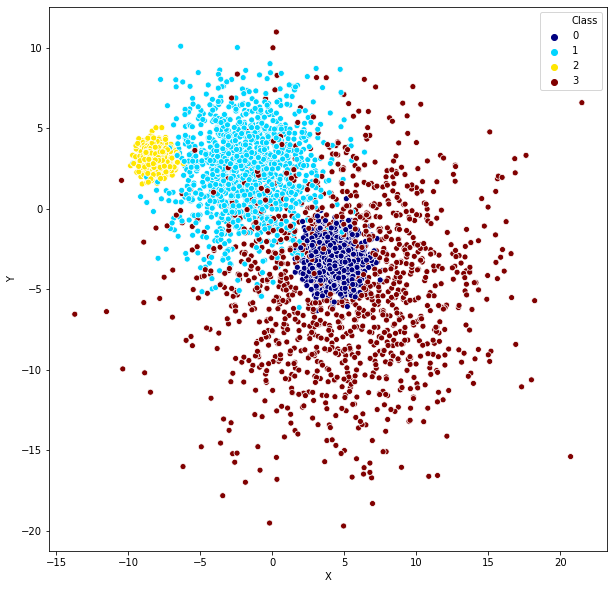
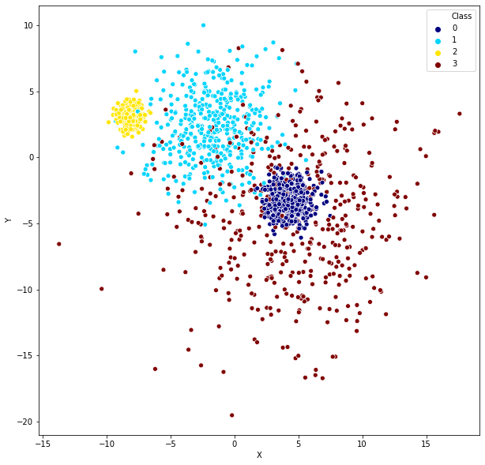
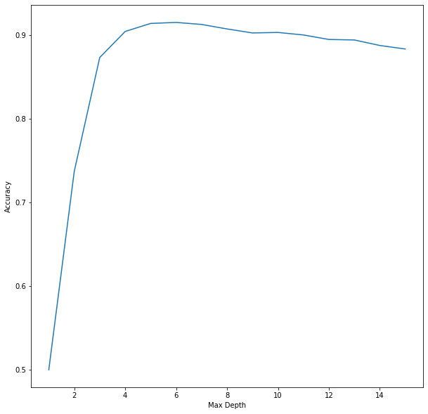
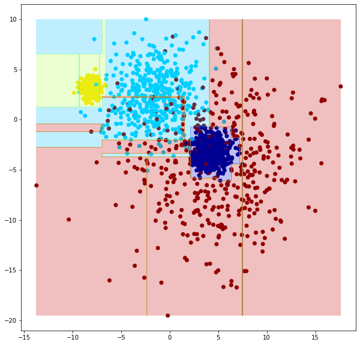
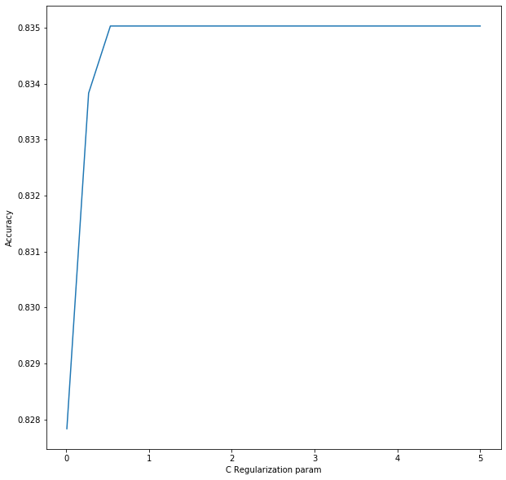
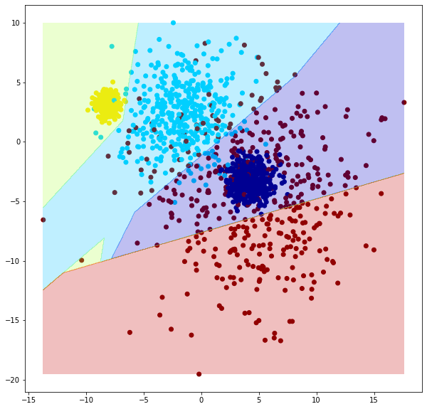
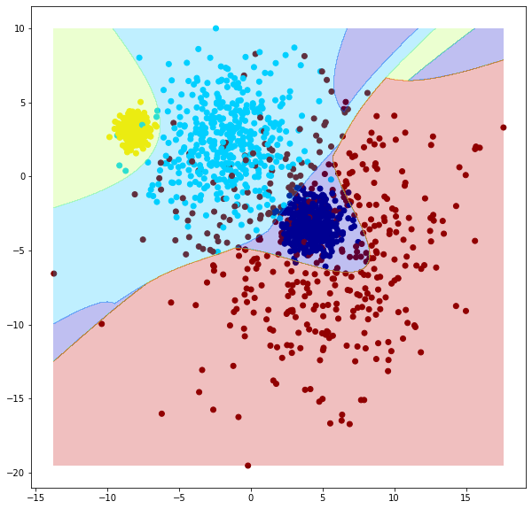
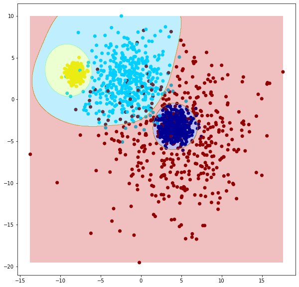

# **Classification Continued**

**Today we look at two new Classification Algorithms. Decision Tree and Support Vector Machine. For this we will use a new synthetic dataset *clustering_classification.csv*. Lets load the data>**


```python
import pandas as pd
import numpy as np
import seaborn as sns
import matplotlib.pyplot as plt

df = pd.read_csv('practice/clustering_classification.csv')
df.head()
```


<div>
<table border="1" class="dataframe">
  <thead>
    <tr style="text-align: right;">
      <th></th>
      <th>X</th>
      <th>Y</th>
      <th>Class</th>
    </tr>
  </thead>
  <tbody>
    <tr>
      <th>0</th>
      <td>11.971797</td>
      <td>-7.504889</td>
      <td>3</td>
    </tr>
    <tr>
      <th>1</th>
      <td>-8.277160</td>
      <td>3.589366</td>
      <td>2</td>
    </tr>
    <tr>
      <th>2</th>
      <td>6.159895</td>
      <td>-3.174328</td>
      <td>3</td>
    </tr>
    <tr>
      <th>3</th>
      <td>-8.445008</td>
      <td>3.845746</td>
      <td>2</td>
    </tr>
    <tr>
      <th>4</th>
      <td>-8.012580</td>
      <td>2.902211</td>
      <td>2</td>
    </tr>
  </tbody>
</table>
</div>


```python
df.describe()
```


<div>
<table border="1" class="dataframe">
  <thead>
    <tr style="text-align: right;">
      <th></th>
      <th>X</th>
      <th>Y</th>
      <th>Class</th>
    </tr>
  </thead>
  <tbody>
    <tr>
      <th>count</th>
      <td>5000.000000</td>
      <td>5000.000000</td>
      <td>5000.000000</td>
    </tr>
    <tr>
      <th>mean</th>
      <td>-0.178067</td>
      <td>-0.579911</td>
      <td>1.500000</td>
    </tr>
    <tr>
      <th>std</th>
      <td>5.998181</td>
      <td>4.412769</td>
      <td>1.118146</td>
    </tr>
    <tr>
      <th>min</th>
      <td>-13.718486</td>
      <td>-19.716218</td>
      <td>0.000000</td>
    </tr>
    <tr>
      <th>25%</th>
      <td>-7.127540</td>
      <td>-3.457994</td>
      <td>0.750000</td>
    </tr>
    <tr>
      <th>50%</th>
      <td>0.393012</td>
      <td>-0.002115</td>
      <td>1.500000</td>
    </tr>
    <tr>
      <th>75%</th>
      <td>4.487479</td>
      <td>3.094766</td>
      <td>2.250000</td>
    </tr>
    <tr>
      <th>max</th>
      <td>21.494466</td>
      <td>10.981597</td>
      <td>3.000000</td>
    </tr>
  </tbody>
</table>
</div>


**Lets visualize the distribution of the classes on the plane>**


```python
plt.figure(figsize = (10, 10))
sns.scatterplot(data=df, x='X', y='Y', hue='Class', palette='jet')
```


    <matplotlib.axes._subplots.AxesSubplot at 0x24a733346d8>





**In order to be able to optimize hyperparameters and then be able to compare the optimized models we need 3 sets of data. One for training the model (train set), another one for evaluating the model with different hyperparameters (test set), and we need a completely unseen data to evaluate the different optimized models (validation set). We need the validation  to be different from the test set, to make sure the models have not simply overtuned for the test set. We can use [numpy.split](https://numpy.org/doc/stable/reference/generated/numpy.split.html?highlight=split) to do this. Lets split the data into 3 sets evenly>**


```python
# we define cut points for split function, df.sample needed to shuffle the dataset first
train, test, validation = np.split(df.sample(frac=1, random_state=42), [int(.33333 * len(df)), int(.66666 * len(df))])
len(train), len(test), len(validation)
```


    (1666, 1667, 1667)


**Lets visualize the training data just to make sure it is representative of the whole dataset>**


```python
plt.figure(figsize = (10, 10))
sns.scatterplot(data=train, x='X', y='Y', hue='Class', palette='jet')
```


    <matplotlib.axes._subplots.AxesSubplot at 0x24a7543efd0>





**Lets convert the data to sklearn format>**


```python
X_train = train[['X', 'Y']].values
y_train = train['Class'].values
X_test = test[['X', 'Y']].values
y_test = test['Class'].values
X_validation = validation[['X', 'Y']].values
y_validation = validation['Class'].values
```

**First let us build a [Decision Tree](https://scikit-learn.org/stable/modules/generated/sklearn.tree.DecisionTreeClassifier.html). We will optimize the max depth hyperparameter and visualize the [accuracy](https://scikit-learn.org/stable/modules/generated/sklearn.metrics.accuracy_score.html) change on the test set as we increase the max depth parameter>**


```python
from sklearn.tree import DecisionTreeClassifier
from sklearn.svm import SVC
from sklearn.metrics import accuracy_score

accuracy_scores = []
max_depths = []

for max_depth in range(1, 16):
    model = DecisionTreeClassifier(max_depth=max_depth)
    model.fit(X_train, y_train)
    
    test_predictions = model.predict(X_test)
    test_accuracy = accuracy_score(y_test, test_predictions)
    
    max_depths.append(max_depth)
    accuracy_scores.append(test_accuracy)
    
plt.figure(figsize = (10, 10))
ax = sns.lineplot(x=max_depths, y=accuracy_scores)
ax.set(xlabel='Max Depth', ylabel='Accuracy')
print(f'Best accuracy score {max(accuracy_scores)} achieved at max depth {max_depths[np.argmax(accuracy_scores)]}')

model1 = DecisionTreeClassifier(max_depth=max_depths[np.argmax(accuracy_scores)])
model1.fit(X_train, y_train)
```

    Best accuracy score 0.9154169166166767 achieved at max depth 6
    


    DecisionTreeClassifier(ccp_alpha=0.0, class_weight=None, criterion='gini',
                           max_depth=6, max_features=None, max_leaf_nodes=None,
                           min_impurity_decrease=0.0, min_impurity_split=None,
                           min_samples_leaf=1, min_samples_split=2,
                           min_weight_fraction_leaf=0.0, presort='deprecated',
                           random_state=None, splitter='best')





**As we can see the best max depth is 6. Let us now create a visualization to see how the model sees this problem and how it divides the problem space>**


```python
def plot_model(model, train):
    plt.figure(figsize = (10, 10))

    fig, ax = plt.subplots(figsize = (10, 10))

    ax.scatter(train['X'], train['Y'], c=y_train, cmap='jet')

    X, Y = np.meshgrid(np.linspace(train['X'].min(), train['X'].max(), 1000), 
                np.linspace(train['Y'].min(), train['Y'].max(), 1000))

    # ravel flattens, c_ combines into matrix
    Z = model.predict(np.c_[X.ravel(), Y.ravel()])
    Z = Z.reshape(X.shape)

    ax.contourf(X, Y, Z, cmap='jet', alpha=0.25)
    
plot_model(model1, train)
```


    <Figure size 720x720 with 0 Axes>





**As we can see the Decision Tree can only split the problem space along the attribute axes.
We can also visualize the actual decision tree using [plot_tree](https://scikit-learn.org/stable/modules/generated/sklearn.tree.plot_tree.html) method from sklearn>**


```python
# https://towardsdatascience.com/visualizing-decision-trees-with-python-scikit-learn-graphviz-matplotlib-1c50b4aa68dc
from sklearn.tree import plot_tree

plt.figure(figsize = (150, 150))

plot_tree(model1, feature_names=df.columns[:-1], class_names=df['Class'].unique().astype('str'), filled=True)
```


    [Text(2910.9375, 7571.571428571428, 'X <= -6.965\ngini = 0.75\nsamples = 1666\nvalue = [421, 418, 407, 420]\nclass = 3'),
     Text(776.25, 6406.714285714286, 'Y <= 1.269\ngini = 0.056\nsamples = 417\nvalue = [0, 8, 405, 4]\nclass = 1'),
     Text(270.0, 5241.857142857143, 'Y <= -2.748\ngini = 0.5\nsamples = 8\nvalue = [0, 4, 0, 4]\nclass = 2'),
     Text(135.0, 4077.0, 'gini = 0.0\nsamples = 3\nvalue = [0, 0, 0, 3]\nclass = 0'),
     Text(405.0, 4077.0, 'Y <= -0.406\ngini = 0.32\nsamples = 5\nvalue = [0, 4, 0, 1]\nclass = 2'),
     Text(270.0, 2912.142857142857, 'Y <= -1.22\ngini = 0.5\nsamples = 2\nvalue = [0, 1, 0, 1]\nclass = 2'),
     Text(135.0, 1747.2857142857138, 'gini = 0.0\nsamples = 1\nvalue = [0, 1, 0, 0]\nclass = 2'),
     Text(405.0, 1747.2857142857138, 'gini = 0.0\nsamples = 1\nvalue = [0, 0, 0, 1]\nclass = 0'),
     Text(540.0, 2912.142857142857, 'gini = 0.0\nsamples = 3\nvalue = [0, 3, 0, 0]\nclass = 2'),
     Text(1282.5, 5241.857142857143, 'Y <= 6.537\ngini = 0.019\nsamples = 409\nvalue = [0, 4, 405, 0]\nclass = 1'),
     Text(1147.5, 4077.0, 'X <= -9.274\ngini = 0.015\nsamples = 408\nvalue = [0, 3, 405, 0]\nclass = 1'),
     Text(810.0, 2912.142857142857, 'X <= -9.373\ngini = 0.375\nsamples = 4\nvalue = [0, 1, 3, 0]\nclass = 1'),
     Text(675.0, 1747.2857142857138, 'gini = 0.0\nsamples = 3\nvalue = [0, 0, 3, 0]\nclass = 1'),
     Text(945.0, 1747.2857142857138, 'gini = 0.0\nsamples = 1\nvalue = [0, 1, 0, 0]\nclass = 2'),
     Text(1485.0, 2912.142857142857, 'X <= -7.233\ngini = 0.01\nsamples = 404\nvalue = [0, 2, 402, 0]\nclass = 1'),
     Text(1215.0, 1747.2857142857138, 'X <= -7.576\ngini = 0.005\nsamples = 393\nvalue = [0, 1, 392, 0]\nclass = 1'),
     Text(1080.0, 582.4285714285716, 'gini = 0.0\nsamples = 348\nvalue = [0, 0, 348, 0]\nclass = 1'),
     Text(1350.0, 582.4285714285716, 'gini = 0.043\nsamples = 45\nvalue = [0, 1, 44, 0]\nclass = 1'),
     Text(1755.0, 1747.2857142857138, 'X <= -7.212\ngini = 0.165\nsamples = 11\nvalue = [0, 1, 10, 0]\nclass = 1'),
     Text(1620.0, 582.4285714285716, 'gini = 0.0\nsamples = 1\nvalue = [0, 1, 0, 0]\nclass = 2'),
     Text(1890.0, 582.4285714285716, 'gini = 0.0\nsamples = 10\nvalue = [0, 0, 10, 0]\nclass = 1'),
     Text(1417.5, 4077.0, 'gini = 0.0\nsamples = 1\nvalue = [0, 1, 0, 0]\nclass = 2'),
     Text(5045.625, 6406.714285714286, 'X <= 2.166\ngini = 0.668\nsamples = 1249\nvalue = [421, 410, 2, 416]\nclass = 3'),
     Text(3476.25, 5241.857142857143, 'Y <= -2.013\ngini = 0.372\nsamples = 514\nvalue = [2, 389, 2, 121]\nclass = 2'),
     Text(2700.0, 4077.0, 'Y <= -3.718\ngini = 0.26\nsamples = 100\nvalue = [2, 13, 0, 85]\nclass = 0'),
     Text(2430.0, 2912.142857142857, 'X <= -2.285\ngini = 0.029\nsamples = 67\nvalue = [0, 1, 0, 66]\nclass = 0'),
     Text(2295.0, 1747.2857142857138, 'X <= -2.334\ngini = 0.095\nsamples = 20\nvalue = [0, 1, 0, 19]\nclass = 0'),
     Text(2160.0, 582.4285714285716, 'gini = 0.0\nsamples = 19\nvalue = [0, 0, 0, 19]\nclass = 0'),
     Text(2430.0, 582.4285714285716, 'gini = 0.0\nsamples = 1\nvalue = [0, 1, 0, 0]\nclass = 2'),
     Text(2565.0, 1747.2857142857138, 'gini = 0.0\nsamples = 47\nvalue = [0, 0, 0, 47]\nclass = 0'),
     Text(2970.0, 2912.142857142857, 'Y <= -3.335\ngini = 0.533\nsamples = 33\nvalue = [2, 12, 0, 19]\nclass = 0'),
     Text(2835.0, 1747.2857142857138, 'gini = 0.0\nsamples = 3\nvalue = [0, 3, 0, 0]\nclass = 2'),
     Text(3105.0, 1747.2857142857138, 'X <= 1.581\ngini = 0.504\nsamples = 30\nvalue = [2, 9, 0, 19]\nclass = 0'),
     Text(2970.0, 582.4285714285716, 'gini = 0.423\nsamples = 23\nvalue = [0, 7, 0, 16]\nclass = 0'),
     Text(3240.0, 582.4285714285716, 'gini = 0.653\nsamples = 7\nvalue = [2, 2, 0, 3]\nclass = 0'),
     Text(4252.5, 4077.0, 'Y <= 2.3\ngini = 0.168\nsamples = 414\nvalue = [0, 376, 2, 36]\nclass = 2'),
     Text(3915.0, 2912.142857142857, 'X <= 1.23\ngini = 0.25\nsamples = 212\nvalue = [0, 181, 0, 31]\nclass = 2'),
     Text(3645.0, 1747.2857142857138, 'Y <= 2.197\ngini = 0.217\nsamples = 194\nvalue = [0, 170, 0, 24]\nclass = 2'),
     Text(3510.0, 582.4285714285716, 'gini = 0.204\nsamples = 191\nvalue = [0, 169, 0, 22]\nclass = 2'),
     Text(3780.0, 582.4285714285716, 'gini = 0.444\nsamples = 3\nvalue = [0, 1, 0, 2]\nclass = 0'),
     Text(4185.0, 1747.2857142857138, 'X <= 1.503\ngini = 0.475\nsamples = 18\nvalue = [0, 11, 0, 7]\nclass = 2'),
     Text(4050.0, 582.4285714285716, 'gini = 0.486\nsamples = 12\nvalue = [0, 5, 0, 7]\nclass = 0'),
     Text(4320.0, 582.4285714285716, 'gini = 0.0\nsamples = 6\nvalue = [0, 6, 0, 0]\nclass = 2'),
     Text(4590.0, 2912.142857142857, 'X <= -6.567\ngini = 0.067\nsamples = 202\nvalue = [0, 195, 2, 5]\nclass = 2'),
     Text(4455.0, 1747.2857142857138, 'gini = 0.0\nsamples = 2\nvalue = [0, 0, 2, 0]\nclass = 1'),
     Text(4725.0, 1747.2857142857138, 'Y <= 8.185\ngini = 0.049\nsamples = 200\nvalue = [0, 195, 0, 5]\nclass = 2'),
     Text(4590.0, 582.4285714285716, 'gini = 0.04\nsamples = 196\nvalue = [0, 192, 0, 4]\nclass = 2'),
     Text(4860.0, 582.4285714285716, 'gini = 0.375\nsamples = 4\nvalue = [0, 3, 0, 1]\nclass = 2'),
     Text(6615.0, 5241.857142857143, 'X <= 6.325\ngini = 0.513\nsamples = 735\nvalue = [419, 21, 0, 295]\nclass = 3'),
     Text(5602.5, 4077.0, 'Y <= -5.82\ngini = 0.41\nsamples = 559\nvalue = [409, 21, 0, 129]\nclass = 3'),
     Text(5130.0, 2912.142857142857, 'Y <= -6.128\ngini = 0.03\nsamples = 65\nvalue = [1, 0, 0, 64]\nclass = 0'),
     Text(4995.0, 1747.2857142857138, 'gini = 0.0\nsamples = 62\nvalue = [0, 0, 0, 62]\nclass = 0'),
     Text(5265.0, 1747.2857142857138, 'X <= 4.904\ngini = 0.444\nsamples = 3\nvalue = [1, 0, 0, 2]\nclass = 0'),
     Text(5130.0, 582.4285714285716, 'gini = 0.0\nsamples = 2\nvalue = [0, 0, 0, 2]\nclass = 0'),
     Text(5400.0, 582.4285714285716, 'gini = 0.0\nsamples = 1\nvalue = [1, 0, 0, 0]\nclass = 3'),
     Text(6075.0, 2912.142857142857, 'Y <= -0.746\ngini = 0.299\nsamples = 494\nvalue = [408, 21, 0, 65]\nclass = 3'),
     Text(5805.0, 1747.2857142857138, 'Y <= -5.186\ngini = 0.157\nsamples = 446\nvalue = [408, 2, 0, 36]\nclass = 3'),
     Text(5670.0, 582.4285714285716, 'gini = 0.496\nsamples = 11\nvalue = [6, 0, 0, 5]\nclass = 3'),
     Text(5940.0, 582.4285714285716, 'gini = 0.141\nsamples = 435\nvalue = [402, 2, 0, 31]\nclass = 3'),
     Text(6345.0, 1747.2857142857138, 'X <= 4.086\ngini = 0.478\nsamples = 48\nvalue = [0, 19, 0, 29]\nclass = 0'),
     Text(6210.0, 582.4285714285716, 'gini = 0.49\nsamples = 28\nvalue = [0, 16, 0, 12]\nclass = 2'),
     Text(6480.0, 582.4285714285716, 'gini = 0.255\nsamples = 20\nvalue = [0, 3, 0, 17]\nclass = 0'),
     Text(7627.5, 4077.0, 'X <= 7.216\ngini = 0.107\nsamples = 176\nvalue = [10, 0, 0, 166]\nclass = 0'),
     Text(7155.0, 2912.142857142857, 'Y <= -1.802\ngini = 0.343\nsamples = 41\nvalue = [9, 0, 0, 32]\nclass = 0'),
     Text(6885.0, 1747.2857142857138, 'Y <= -4.409\ngini = 0.463\nsamples = 22\nvalue = [8, 0, 0, 14]\nclass = 0'),
     Text(6750.0, 582.4285714285716, 'gini = 0.0\nsamples = 13\nvalue = [0, 0, 0, 13]\nclass = 0'),
     Text(7020.0, 582.4285714285716, 'gini = 0.198\nsamples = 9\nvalue = [8, 0, 0, 1]\nclass = 3'),
     Text(7425.0, 1747.2857142857138, 'X <= 6.788\ngini = 0.1\nsamples = 19\nvalue = [1, 0, 0, 18]\nclass = 0'),
     Text(7290.0, 582.4285714285716, 'gini = 0.0\nsamples = 12\nvalue = [0, 0, 0, 12]\nclass = 0'),
     Text(7560.0, 582.4285714285716, 'gini = 0.245\nsamples = 7\nvalue = [1, 0, 0, 6]\nclass = 0'),
     Text(8100.0, 2912.142857142857, 'X <= 7.531\ngini = 0.015\nsamples = 135\nvalue = [1, 0, 0, 134]\nclass = 0'),
     Text(7965.0, 1747.2857142857138, 'X <= 7.483\ngini = 0.153\nsamples = 12\nvalue = [1, 0, 0, 11]\nclass = 0'),
     Text(7830.0, 582.4285714285716, 'gini = 0.0\nsamples = 11\nvalue = [0, 0, 0, 11]\nclass = 0'),
     Text(8100.0, 582.4285714285716, 'gini = 0.0\nsamples = 1\nvalue = [1, 0, 0, 0]\nclass = 3'),
     Text(8235.0, 1747.2857142857138, 'gini = 0.0\nsamples = 123\nvalue = [0, 0, 0, 123]\nclass = 0')]


**Next up lets try to solve the problem using a Linear [Support Vector Machine](https://scikit-learn.org/stable/modules/generated/sklearn.svm.SVC.html). For the linear kernel we can try optimizing the C regularization parameter>** 


```python
accuracy_scores = []
Cs = []

for C in np.linspace(0.01, 5, 20):
    model = SVC(C=C, kernel='linear')
    model.fit(X_train, y_train)
    
    test_predictions = model.predict(X_test)
    test_accuracy = accuracy_score(y_test, test_predictions)
    
    Cs.append(C)
    accuracy_scores.append(test_accuracy)
    
plt.figure(figsize = (10, 10))
ax = sns.lineplot(x=Cs, y=accuracy_scores)
ax.set(xlabel='C Regularization param', ylabel='Accuracy')
print(f'Best accuracy score {max(accuracy_scores)} achieved at C {Cs[np.argmax(accuracy_scores)]}')

model2 = SVC(C=Cs[np.argmax(accuracy_scores)], kernel='linear')
model2.fit(X_train, y_train)
```

    Best accuracy score 0.8350329934013198 achieved at C 0.5352631578947369
    


    SVC(C=0.5352631578947369, break_ties=False, cache_size=200, class_weight=None,
        coef0=0.0, decision_function_shape='ovr', degree=3, gamma='scale',
        kernel='linear', max_iter=-1, probability=False, random_state=None,
        shrinking=True, tol=0.001, verbose=False)





```python
plot_model(model2, train)
```


    <Figure size 720x720 with 0 Axes>





**As we see this model is a lot worse for this problem. It is worth noting how different the partitioning of the problem space by this model. Next up is the same model with polynomial kernek. We will optimize the degree parameter as well this time>**


```python
# tqdm is used for progress bar visualization
from tqdm import tqdm_notebook

accuracy_scores = []
params = []

for C in tqdm_notebook(np.linspace(0.01, 5, 20), desc='C'):
    for degree in tqdm_notebook(range(2, 10), desc='degree'):
        model = SVC(C=C, degree=degree, kernel='poly')
        model.fit(X_train, y_train)

        test_predictions = model.predict(X_test)
        test_accuracy = accuracy_score(y_test, test_predictions)

        params.append({'C': C, 'degree': degree})
        accuracy_scores.append(test_accuracy)
    
print(f'Best accuracy score {max(accuracy_scores)} achieved at param {params[np.argmax(accuracy_scores)]}')

model3 = SVC(C=params[np.argmax(accuracy_scores)]['C'], degree=params[np.argmax(accuracy_scores)]['degree'], kernel='poly')
model3.fit(X_train, y_train)
```

    Best accuracy score 0.8920215956808638 achieved at param {'C': 3.6868421052631577, 'degree': 3}
    


    SVC(C=3.6868421052631577, break_ties=False, cache_size=200, class_weight=None,
        coef0=0.0, decision_function_shape='ovr', degree=3, gamma='scale',
        kernel='poly', max_iter=-1, probability=False, random_state=None,
        shrinking=True, tol=0.001, verbose=False)


```python
plot_model(model3, train)
```


    <Figure size 720x720 with 0 Axes>





**We note that this model splits the problem space by curves as expected. Lastly we try the RBF kernel. Here we optimize the gamme parameter as well>**


```python
from tqdm import tqdm_notebook

accuracy_scores = []
params = []

for C in tqdm_notebook(np.linspace(0.01, 5, 20), desc='C'):
    for gamma in tqdm_notebook(np.linspace(0.001, 2, 40), desc='gamma'):
        model = SVC(C=C, gamma=gamma, kernel='rbf')
        model.fit(X_train, y_train)

        test_predictions = model.predict(X_test)
        test_accuracy = accuracy_score(y_test, test_predictions)

        params.append({'C': C, 'gamma': gamma})
        accuracy_scores.append(test_accuracy)
    
print(f'Best accuracy score {max(accuracy_scores)} achieved at param {params[np.argmax(accuracy_scores)]}')

model4 = SVC(C=params[np.argmax(accuracy_scores)]['C'], gamma=params[np.argmax(accuracy_scores)]['gamma'], kernel='rbf')
model4.fit(X_train, y_train)
```


    Best accuracy score 0.9280143971205759 achieved at param {'C': 0.7978947368421053, 'gamma': 0.05225641025641026}
    


    SVC(C=0.7978947368421053, break_ties=False, cache_size=200, class_weight=None,
        coef0=0.0, decision_function_shape='ovr', degree=3,
        gamma=0.05225641025641026, kernel='rbf', max_iter=-1, probability=False,
        random_state=None, shrinking=True, tol=0.001, verbose=False)


```python
plot_model(model4, train)
```


    <Figure size 720x720 with 0 Axes>





**Finally lets compare the models on the validation set>**


```python
model1_predictions = model1.predict(X_validation)
model1_accuracy = accuracy_score(y_validation, model1_predictions)

model2_predictions = model2.predict(X_validation)
model2_accuracy = accuracy_score(y_validation, model2_predictions)

model3_predictions = model3.predict(X_validation)
model3_accuracy = accuracy_score(y_validation, model3_predictions)

model4_predictions = model4.predict(X_validation)
model4_accuracy = accuracy_score(y_validation, model4_predictions)

print(f'Validation accuracy is {model1_accuracy} for model DecisionTree(max_depth=6)')
print(f'Validation accuracy is {model2_accuracy} for model SVC(C=0.5352631578947369, kernel=linear)')
print(f'Validation accuracy is {model3_accuracy} for model SVC(C=3.6868421052631577, kernel=poly, degree=3))')
print(f'Validation accuracy is {model4_accuracy} for model SVC(C=0.7978947368421053, kernel=rbf, gamma: 0.05225641025641026)')
```

    Validation accuracy is 0.8986202759448111 for model DecisionTree(max_depth=6)
    Validation accuracy is 0.8158368326334733 for model SVC(C=0.5352631578947369, kernel=linear)
    Validation accuracy is 0.8878224355128974 for model SVC(C=3.6868421052631577, kernel=poly, degree=3))
    Validation accuracy is 0.9148170365926814 for model SVC(C=0.7978947368421053, kernel=rbf, gamma: 0.05225641025641026)
    

**As we can see the best model is the RBF kernel based Support Vector Machine, but Decision Tree is also a very strong competitor despite it's simplicity**


### **Exercise**

Try to do the exercises from the previous practice but with the new models learned today. Tune each model using a test set and compare their predictive performance on a validation set.